# CSCE 435 Group project

## 0. Group number: 1

## 1. Group members:
1. Aidan Heffron
2. Miguel Garcia
3. Joey Quismorio
4. James Evans

## 2. Communication
Our group will communicate with each other through the Group Chat we have created with IMessage. Deadlines and tasks will be discussed well in advance (at least 48 hours for smaller deadlines, 96 for larger ones), giving each team member time to implement their scheduled tasks. Any conflicts should be communicated ASAP to give the team time to adjust. 

---

## 2. Project topic
- Choose 3+ parallel sorting algorithms, implement in MPI and CUDA.  Examine and compare performance in detail (computation time, communication time, how much data is sent) on a variety of inputs: sorted, random, reverse, sorted with 1% perturbed, etc.  Strong scaling, weak scaling, GPU performance

## 2a. Brief project description (what algorithms will you be comparing and on what architectures)
The project will include the following algorithms and architectures:

- Merge Sort (CUDA)
- Merge Sort (MPI)
- Bubble Sort (CUDA)
- Bubble Sort (MPI)
- Bitonic Sort (CUDA)
- Bitonic Sort (MPI)
- Sample Sort (CUDA)
- Sample Sort (MPI)

## 2b. Psuedocode for each parallel algorithm
**Bubble Sort:**

In parallel compution, bubble sort undergoes an adaptation, commonly referred to as the Odd-Even Transposition Sort. This variant is designed to optimize data handling for concurrent operations. The essence of this strategy is to orchestrate the sorting tasks such that they are staggered across different processors, thereby leveraging parallelism.

**MPI:**
```
def bubbleSort(values, local_data_size, numTasks, rankid):
    # Allocate space for the temporary array
    temp = allocate_float_array(local_data_size)

    # Loop over all phases
    for phase in range(numTasks):
        # Determine the neighbor based on the current phase and rank
        neighbor = (rankid + 1) if (phase + rankid) % 2 == 0 else (rankid - 1)

        # Only proceed if the neighbor is within valid range
        if 0 <= neighbor < numTasks:
            # Perform the send and receive operations
            MPI_Sendrecv(values, neighbor, temp, neighbor)

            # Merge the two sorted lists based on rank comparison
            if rankid < neighbor:
                # If the current rank is lower, keep the smaller elements
                for k in range(local_data_size):
                    values[k] = min(values, temp, k)
            else:
                # If the current rank is higher, keep the larger elements
                for k in reversed(range(local_data_size)):
                    values[k] = max(values, temp, k)

    # Deallocate the temporary array after use
    deallocate(temp)
```

**CUDA:**
```
def bubble_sort_step(dev_values, size, even_phase):
    idx = compute_global_index()
    i = 2 * idx + (0 if even_phase else 1)

    if even_phase:
        # Even phase: Compare elements at even indices
        if i < size - 1 - (size % 2) and dev_values[i] > dev_values[i + 1]:
            swap(dev_values[i], dev_values[i + 1])
    else:
        # Odd phase: Compare elements at odd indices
        if i < size - 1 and dev_values[i] > dev_values[i + 1]:
            swap(dev_values[i], dev_values[i + 1])

def bubble_sort(values, size):
    dev_values = allocate_device_memory(size)

    # Copy data from host to device
    copy_host_to_device(values, dev_values)

    # Calculate the number of phases needed
    major_step = size / 2
    threads_per_block = determine_threads_per_block()
    blocks = calculate_number_of_blocks(size, threads_per_block)

    # Perform the sort
    for i in range(size):
        even_phase = (i % 2) == 0
        # Launch the GPU kernel
        gpu_bubble_sort_step(dev_values, size, even_phase)

    # Copy the sorted array back to the host
    copy_device_to_host(values, dev_values)

    # Free the device memory
    free_device_memory(dev_values)
```

**Merge Sort:**

**MPI:**
```


# Initialize MPI
initialize_mpi()
taskid = get_mpi_rank()
numtasks = get_mpi_size()
height = calculate_tree_height(numtasks)

# Check command line arguments and assign number of values to sort
numVals = get_command_line_argument()

# Master Process
if taskid == MASTER:
    # Allocate and initialize values array with random floats
    global_array = allocate_float_array(numVals)
    array_fill_random(values)


    # Scatter values to worker processes
    MPI_Scatter((values)

# Worker Process
else:
    # Allocate local array for sorting
    localArray = allocate_float_array(localArraySize)


# Finalize
# Gather sorted sub-arrays at master process
if taskid == MASTER:
    # Merge Sort
    # Perform local sort and merge operations
    sorted_values = merge_sort_recursive(tree_height, taskid, local_array,global_array)
    

    # Check if the final array is sorted
    check_if_array_is_sorted(global_array)

    # Record computation times and print
    print_computation_times()

# Finalize MPI and clean up resources
MPI_Finalize();

def merge_sort_recursive(tree_height, taskid, local_array):
    current_depth = 0
    sorted_subarray = sort(local_array)  # Perform an initial local sort

    while current_depth < tree_height:
        parent_id = taskid bitwise_and (bitwise_not(1 left_shift current_depth))
        
        if parent_id == taskid:
            # This is a left child or the root
            right_child_id = taskid bitwise_or (1 left_shift current_depth)
            
            # Receive a sorted sub-array from the right child
            received_array = MPI_Recv(right_child_id)
            
            # Merge the sorted sub-array with the current sorted sub-array
            merged_array = merge(sorted_subarray, received_array)
            
            # Prepare for the next level
            sorted_subarray = merged_array
            increase the size of subarray to reflect merged size
            
            current_depth += 1
        else:
            # This is a right child, send sorted sub-array to the parent
            MPI_Send(sorted_subarray, parent_id)
            break  # Exit the loop since the right child's job is done

    # If this is the root process, copy the sorted array to the full array
    if taskid == 0:
        full_array = copy(sorted_subarray)

    return full_array


```

**CUDA:**
```
def merge_sort_step(dev_values, temp, start, middle, end):
    i, j, k = start, middle, start

    # Merge the two halves
    while i < middle and j < end:
        if dev_values[i] < dev_values[j]:
            temp[k] = dev_values[i]
            i += 1
        else:
            temp[k] = dev_values[j]
            j += 1
        k += 1

    # Copy remaining values from the first half
    while i < middle:
        temp[k] = dev_values[i]
        i += 1
        k += 1

    # Copy remaining values from the second half
    while j < end:
        temp[k] = dev_values[j]
        j += 1
        k += 1

    # Copy merged values back to original array
    for index in range(start, end):
        dev_values[index] = temp[index]

def merge_sort(values):
    dev_values, temp = allocate_device_memory(NUM_VALS), allocate_device_memory(NUM_VALS)

    # Copy data from host to device
    copy_host_to_device(values, dev_values)

    threads_per_block = determine_threads_per_block()
    blocks = calculate_number_of_blocks()

    # Merge sort with increasing width
    width = 1
    while width < NUM_VALS:
        for i in range(0, NUM_VALS, 2 * width):
            # Calculate boundaries
            start = i
            middle = min(i + width, NUM_VALS)
            end = min(i + 2 * width, NUM_VALS)

            # Launch the GPU kernel
            gpu_merge_sort_step(dev_values, temp, start, middle, end)
            synchronize_gpu()

            width *= 2

    # Copy the sorted array back to the host
    copy_device_to_host(values, dev_values)

    # Free the device memory
    free_device_memory(dev_values)
    free_device_memory(temp)
```

**Sample Sort:**

**MPI:**
```
def sampleSort(global_array, values, rankid, local_data_size, numTasks):
    quicksort(values, local_data_size)

    # Select local samples
    samples = [values[i * local_data_size / numTasks] for i in range(numTasks)]
    all_samples = allocate_array(numTasks * numTasks)

    # Synchronize before gathering all samples
    mpi_barrier()

    # Gather samples at root
    all_samples = mpi_gather(samples, numTasks, root=0)

    # Root process sorts all samples and selects pivots
    if rankid == 0:
        quicksort(all_samples, numTasks * numTasks)
        for i in range(1, numTasks):
            samples[i] = all_samples[i * numTasks + numTasks // 2]

    # Broadcast selected pivots to all processes
    samples = mpi_bcast(samples, numTasks, root=0)

    # Classify local data based on selected pivots
    localCounts = [0 for _ in range(numTasks)]
    localDisplacements = [0 for _ in range(numTasks)]

    for value in values:
        placed = False
        for k in range(1, numTasks - 1):
            if value < samples[k]:
                localCounts[k - 1] += 1
                placed = True
                break
        if not placed:
            localCounts[numTasks - 1] += 1

    # Calculate local displacements
    for i in range(1, numTasks):
        localDisplacements[i] = sum(localCounts[:i])

    # Perform all-to-all communication to share counts
    extCounts = mpi_alltoall(localCounts)

    # Calculate external displacements
    extDisplacements = [sum(extCounts[:i]) for i in range(1, numTasks)]
    extDisplacements.insert(0, 0)

    # Perform a global reduction to get the total counts
    globalCounts = mpi_allreduce(localCounts, op='sum')

    # Synchronize before the all-to-all communication
    mpi_barrier()

    # Distribute data based on counts and displacements
    sortedData = allocate_array(globalCounts[rankid])
    mpi_alltoallv(values, localCounts, localDisplacements, sortedData, extCounts, extDisplacements)

    # Locally sort the received data
    quicksort(sortedData, globalCounts[rankid])

    # Calculate global displacements for final gather
    globalDisplacements = [sum(globalCounts[:i]) for i in range(1, numTasks)]
    globalDisplacements.insert(0, 0)

    # Synchronize before gathering the sorted data
    mpi_barrier()

    # Gather the sorted data at the root
    mpi_gatherv(sortedData, globalCounts[rankid], global_array, globalCounts, globalDisplacements, root=0)
```

**CUDA:**
```
    __global__ partitionAndSample():
        // responsible for sorting data from the blocks partition and sampling it
        for i in range(local_chunk):
            for j in range(start_offset, end_offset):
                if(dev_values[j] > dev_values[j+1]):
                    swap()
        
        for i in range(num_of_samples):
            all_samples[thread_offset] = local_values[sample_offset]
    
    __global__ findDisplacements():
        // responsible for find what values in a block need to be sent elsewhere and where to send them
        for i in range(local_chunk):
            for k in range(num_blocks):
                if(local_values[i] < pivots[k]):
                    localCounts[k]++

        for i in range(num_blocks):
            sum = 0
            for k in range(i-1, 0, -1):
                sum += localCounts[k]
            localDisplacements[i] = sum

        for i in range(num_blocks):
            incoming_value_count[thread_offset] = localCounts[i] // incoming_value_count = float[num_blocks*num_samples], a global variable
            displacements[thread_offset] = localDisplacements[i] // displacements = float[num_blocks*num_samples], a global variable

    __global__ sendDisplacedValues():
        // responsible for sending values to their final block
        for i in range(num_blocks):
            for k in range(displacements[thread_offset], incoming_value_count[thread_offset]):
                offset = k - displacement[thread_offset]

                for j in range(threadID):
                    offset += incoming_value_count[j*num_blocks+i]

                if i > 0:
                    for n in range(i):
                        offset += final_value_count[n]

                final_sorted_values[offset] = local_values[k] // final_sorted_values is an empty array of size NUM_VALS

    __global__ finalSort():
        // each process sorts its last partition
        for i in range(final_value_count[threadID]):
            for j in range(final_value_count[threadID]-i-1):
                if(final_local_values[j] > final_local_values[j+1]):
                    swap()
        
        for i in range(final_value_count[threadID]):
            final_sorted_values[offset] = final_local_values[i]

    sample_sort(values):
        local_chunk = NUM_VALS / BLOCKS
        
        cudaMalloc(all_samples, BLOCKS*num_of_samples*sizeof(float))
        cudaMalloc(dev_values, NUM_VALS*sizeof(float))

        cudaMemcpy(dev_values, values, NUM_VALS*sizeof(float), HostToDevice)

        partitionAndSample<<<blocks, threads>>>()

        cudaDeviceSynchronize();

        float* final_samples;
        cudaMemcpy(final_samples, all_samples, BLOCKS*num_of_samples*sizeof(float), DeviceToHost);

        sort(final_samples)
        find_pivots(final_samples);

        cudaMemcpy(final_pivots, pivots, BLOCKS-1 * sizeof(float), HostToDevice);

        findDisplacements<<<blocks, threads>>>();

        cudaDeviceSynchronize();

        sendDisplacedValues<<<blocks, threads>>>();

        cudaDeviceSynchronize();

        finalSort<<<blocks, threads>>>();

        cudaDeviceSynchronize();

        cudaMemcpy(values, final_sorted_values, NUM_VALS, DeviceToHost);


```
**Bitonic Sort:**

**MPI:**
```
   # Function to sort in descending order
def sortDesc(a, b):
    # Convert pointers to float values
    first = *((float *)a)
    second = *((float *)b)

    # Compare and return appropriate values for descending order
    if first < second:
        return 1
    elif first > second:
        return -1
    else:
        return 0

# Function to sort in ascending order
def sortAsc(a, b):
    # Convert pointers to float values
    first = *((float *)a)
    second = *((float *)b)

    # Compare and return appropriate values for ascending order
    if first < second:
        return -1
    elif first > second:
        return 1
    else:
        return 0

# Function to exchange and sort data between processes
def exchangeAndSort(data, count, proc1, proc2, descOrder, seqNo):
    # Only proceed if the current process is one of the specified processes
    if processId != proc1 and processId != proc2:
        return

    # Allocate temporary storage and copy data into it
    tempData = allocate_array(count * sizeof(float))
    memcpy(tempData, data, count * sizeof(float))

    # Determine the other process involved in the exchange
    otherProc = proc1 if proc1 == processId else proc2

    # Exchange data between the two processes
    if proc1 == processId:
        mpi_send(data, count, MPI_FLOAT, otherProc, seqNo)
        mpi_recv(&tempData[count], count, MPI_FLOAT, otherProc, seqNo)
    else:
        mpi_recv(&tempData[count], count, MPI_FLOAT, otherProc, seqNo)
        mpi_send(data, count, MPI_FLOAT, otherProc, seqNo)

    # Sort the combined data in the specified order
    if descOrder:
        qsort(tempData, count * 2, sizeof(float), sortDesc)
    else:
        qsort(tempData, count * 2, sizeof(float), sortAsc)

    # Copy the sorted data back into the original array
    if proc1 == processId:
        memcpy(data, tempData, count * sizeof(float))
    else:
        memcpy(data, &tempData[count], count * sizeof(float))

# Function to perform bitonic merge sort
def bitonicMergeSort(data, count):
    # Allocate temporary storage for sorting
    tempData = allocate_array(count * 2 * sizeof(float))

    # Initialize variables for the sorting process
    logN = totalProcesses
    powerOf2 = 2
    seqNo = 0

    # Main sorting loop
    for i in range(1, logN > 1):
        powerOf2j = powerOf2
        for j in range(i, 0, -1):
            seqNo += 1
            # Perform sorting and data exchange among processes
            for proc in range(0, totalProcesses, powerOf2j):
                for k in range(powerOf2j // 2):
                    exchangeAndSort(data, count, proc + k, proc + k + powerOf2j // 2, (proc + k) % (powerOf2 * 2) >= powerOf2, seqNo)
            powerOf2j //= 2
        powerOf2 *= 2
        logN //= 2

    # Free the temporary storage
    free(tempData)

# Main function to execute the bitonic sort
def main(argc, argv):
    # Initialize MPI environment
    mpi_init(argc, argv)
    totalProcesses = mpi_comm_size(MPI_COMM_WORLD)
    processId = mpi_comm_rank(MPI_COMM_WORLD)
    hostName, nameLen = mpi_get_processor_name()

    # Parse command line arguments for total values and sort type
    totalValues = atoi(argv[1])
    sortType = atoi(argv[2])
    arraySize = totalValues // totalProcesses

    # Calculate the starting index for the current process
    start = processId * arraySize
    # Create an array of data to sort
    data = createArray(arraySize, start, sortType)

    # Perform the bitonic merge sort
    bitonicMergeSort(data, arraySize)

    # Gather sorted data at the root process
    if processId == 0:
        allData = allocate_array(arraySize * totalProcesses * sizeof(float))

    mpi_gather(data, arraySize, MPI_FLOAT, allData, arraySize, MPI_FLOAT, 0)

    # Free allocated memory at the root process
    if processId == 0:
        free(allData)
```
**CUDA:**
```
// CUDA function to perform the organization of ascending/descending bitonic sequences step in the bitonic sort algorithm
__global__ void bitonic_sort_step:
    // This function computes a step in the bitonic sort algorithm
    // It is designed to run on the GPU

    // Calculate the indices for the elements to be compared
    i = threadIdx + blockDim * blockIdx;
    ixj = i XOR j;

    // Perform the comparison and possibly swap elements
    if (ixj > i):
        if ((i AND k) == 0 and dev_values[i] > dev_values[ixj]):
            // Swap for an ascending bitonic sequence
            swap(dev_values[i], dev_values[ixj]);
         else if ((i AND k) != 0 and dev_values[i] < dev_values[ixj]):
            // Swap for a descending bitonic sequence
            swap(dev_values[i], dev_values[ixj]);

// Function to sort an array using the bitonic sort algorithm
function bitonic_sort():
    // Allocate memory on the GPU and copy data from the host
    cudaMalloc(dev_values, size);
    cudaMemcpy(dev_values, values, size, hostToDevice);

    // Set up CUDA blocks and threads
    blocks = (BLOCKS, 1);
    threads = (THREADS, 1);

    // Perform the bitonic sort
    (for k = 2 to NUM_VALS step k <<= 1):
        (for j = k>>1 to 0 step j=j>>1):
            // Launch the bitonic sort step kernel
            bitonic_sort_step<<<blocks, threads>>>(dev_values, j, k);

    // Synchronize CUDA device to ensure all tasks are completed
    cudaDeviceSynchronize();

    // Copy the sorted data back to the host
    cudaMemcpy(values, dev_values, size, deviceToHost);

    // Free GPU memory
    cudaFree(dev_values);


// Main function
main():
    // Initialize parameters like THREADS, NUM_VALS, and BLOCKS
    THREADS = parseInteger(argv[1]);
    NUM_VALS = parseInteger(argv[2]);
    BLOCKS = NUM_VALS / THREADS;

    // Allocate memory for the array and fill it with data
    values = allocateArray(NUM_VALS);
    fill_array(values);

    // Sort the array
    bitonic_sort(values);
```

For each algorithm and architecture, the code will test the performance of the sorting algorithm, the performance of the communication used, strong and weak scaling, etc. Algorithms implemented with MPI on each core will follow the master/worker organization, and will look something like:

```
main {
    MPI_Init();
    MPI_Comm_rank(MPI_COMM_WORLD, &taskid)
    MPI_Comm_size(MPI_COMM_WORKLD, &numtasks)

    if(taskid == MASTER) {
        // split array up and assign sections to workers
        for destination in numworkers:
            MPI_Send(/* part to sort */);

        // receive results from workers
        for result in numworkers:
            MPI_Recv(...)

    }

    if(taskid != MASTER) {
        // receive part to sort from master
        MPI_Recv(...)

        // sort array following whatever algorithm is being used (i.e merge sort, radix sort, etc.)
        sort_array()

        // send sorted array back to master
        MPI_Send(...)

    }

    // Reduce to calculate time of worker processes for analytics
    MPI_Reduce(...)

}
```

Algorithms implemented with MPI and CUDA will follow the SIMD organization, and will look something like:

```
__global__ void function current_algorithm_step {
    // this function computes a step for whatever sorting algorithm is currently being used (i.e merge sort, radix sort, etc.)
    // it is a cuda function to run on the GPU
}

function sort_array() {
    cudaEvent_t start, stop;

    cudaMemcpy(dev_values, values, size, hostToDevice)

    for i in major_step:
        for j in minor_step:
            current_algorithm_step<<<blocks, threads>>>

    synchronize()

    cudaMemcpy(values, dev_values, size, deviceToHost)

}

main {
    fill_array()
    sort_array()
    analyze_results()
}

```

Each algorithm will have different inputs and be tested at different scales to see how it performs.

### 2c. Evaluation plan - what and how will you measure and compare
- Input sizes, Input types
- Strong scaling (same problem size, increase number of processors/nodes)
- Weak scaling (increase problem size, increase number of processors)
- Number of threads in a block on the GPU 

## 4. Performance Evaluation

### Sample Sort Performance:
#### MPI Implementation:


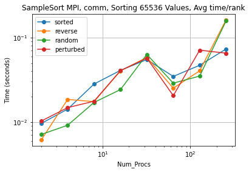


#### Cuda Implementation:

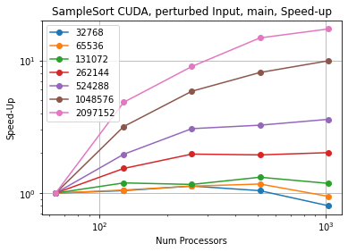


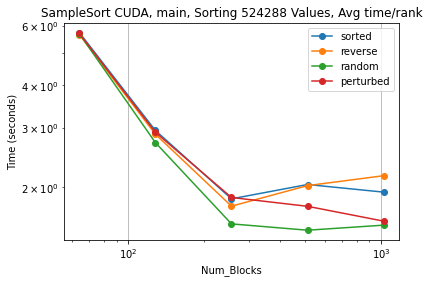


---
### Merge Sort Performance:
#### MPI Implementation:

#### Cuda Implementation:

---
### Odd-Even Sort Performance:
#### MPI Implementation:


#### Cuda Implementation:
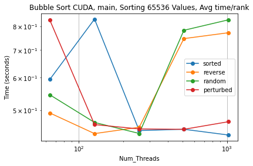


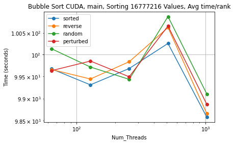


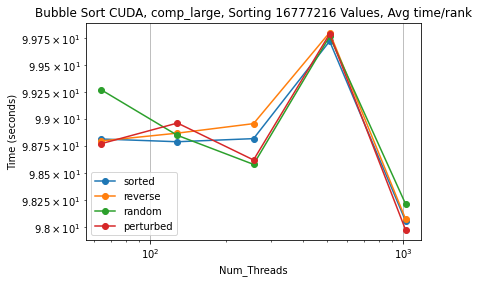


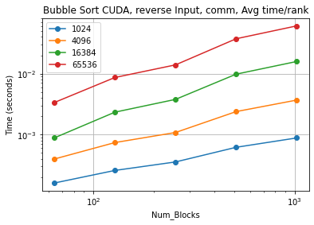


---
### Bitonic Sort Performance:
#### MPI Implementation:

#### Cuda Implementation:

---
### Combined Graphs:
#### MPI Implementation:


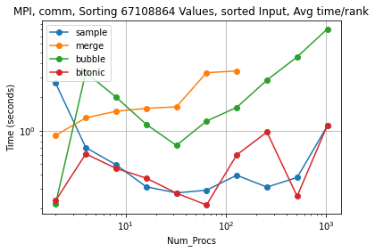


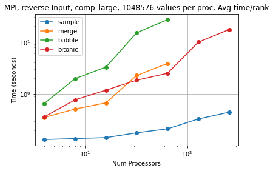


#### Cuda Implementation


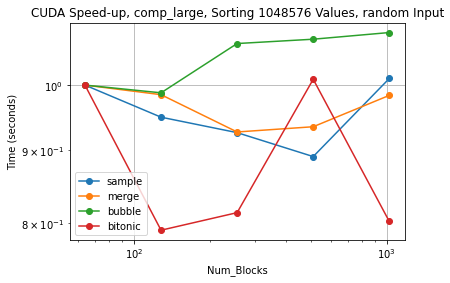


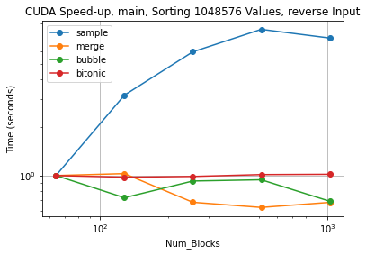


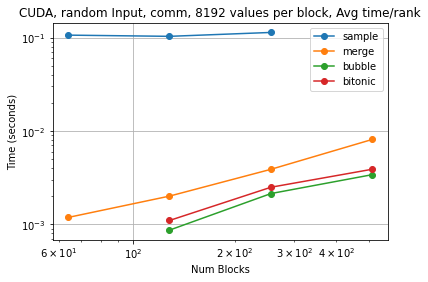


---

## Analysis

### Sample Sort
#### MPI
The sample sort mpi implementation works very well when it comes to scaling. For strong scaling, the graphs show that as the overall amount of processes increases, the time it takes for the computation, communication, and main parts of the program decreases. This becomes much more apparent when the Input Size of the array is much larger, as there is more opportunity for the algorithm to parallelize the work. 

When it comes to weak scaling, we can see that as the amount of values per processes stays the same, the average time it takes processes to complete stays generally stable. However, due to some overhead in terms of communication, as you add more and more processors, the time that it takes to process the same amount of values increases a little bit.

Along with this, we can see that the input type (reverse, random, perturbed, or sorted) does have some role in the overall efficiency of the implementation. Random inputs tend to take a bit longer to process than sorted or perturbed inputs. 

The speed up in MPI is very good. As the input size increases, you can see that the program speeds up as would be expected, almost linearlly. 

#### CUDA
The cuda implementation of sample sort does not perform just as well as the mpi version. Due to some memory constraints on the GPU, the cuda implemenation was not able to scale to as many values as the mpi version was. However, the trends are still the same and very much evident. Strong scaling works very well for the cuda implementation, as adding more processors decreases the amount of time it takes to sort the array.

Weak scaling follows the same trend as it did in MPI, as adding more and more blocks computing the same amount of values causes a slight increase in the amount of time it takes due to communication concerns. 

The input type can show as well that random inputs tend to perform the worst out of all.

The speed up in CUDA is also very good, however could be improved by sorting larger input sizes. However, the speed up plot still shows that as the input size increases, so too does the speedup.

---
### Merge Sort
#### MPI


#### CUDA

---
### Odd-Even Sort
#### MPI


#### CUDA

---
### Bitonic Sort
#### MPI


#### CUDA

---
### Combined Plots
Our combined plots show that generally sample sort performs the best. Due to the overall nature of the sample sort algorithm, there are less bottlenecks in the implementation. The only sequential portions occur when sorting a small amount of samples and communicating those back to every process. Beyond that, everything is usually pretty parallel. In contrast, merge, odd-even, and bitonic sort tend to have a few more bottlenecks in their implementation and thus perform slightly worse than sample. 

All implementations tend to have pretty similar weak scaling trends, while sample sort demonstrates much better strong scaling. 